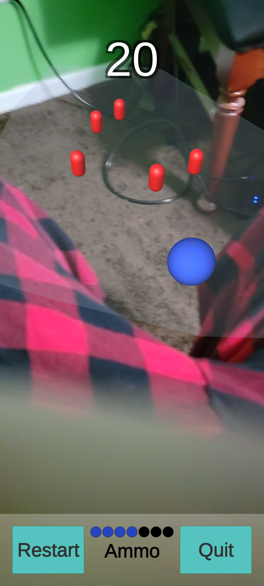

# 0x00. Unity - AR Slingshot Game

#### What is this repository?
This is a Unity project using Vuforia to build a slingshot augmented reality game for mobile devices. It uses plane detection to highlight surfaces on which to spawn targets before the player chooses one. AFterward, the player has 7 shots to hit the target, denoted by colored balls at the bottom. They can pull back the ball in any direction by moving a finger on the scree. Letting go fires the slingshot with simulated physics. On hitting a target, the player's score at the top of the screen goes up. A play again button displays after reaching 0 ammo, which will reset ammo and score. The restart button begins the applications at the plane detection stage and a quit button exits the application. The bulk of development time was spent on writing/improving the physics and target AI scripts.

#### Challenges
* Line renderer physics: I started with actual physics equations and had to change a couple numbers to make it work, but it now follows perfectly.
* NavMesh and AI: A lot of the first iterations all attempted to add a NavMesh to the chosen surface that never seemed to apply. In looking for a reference to give to the NavMesh Agent as a destination, I finally realized those mesh coordinates could be used without the NavMesh entirely.

#### About Me
I'm an AR/VR student at Holberton School who's passionate about logical problem-solving and creating dynamic experiences. Find me on [LinkedIn](https://www.linkedin.com/in/jacobfchavera/).

#### Learning Objectives
- What is ARKit
- What is ARCore
- What is ARFoundation
- How does plane detection work
- How to detect planes using AR Foundation
- How to publish applications for both Android and iOS with Unity’s AR Foundation
- How to create responsive UI for mobile devices
- How to design in an augmented reality space
- What does SLAM stand for and what does it mean

##### How to use
* Clone this repository
* Open the project in Unity3D
* Built to your system (Android or iOS)
* For iOS: build to your phone with XCode

##### Known Bugs
- Plane selection doesn't always line up with touched target
