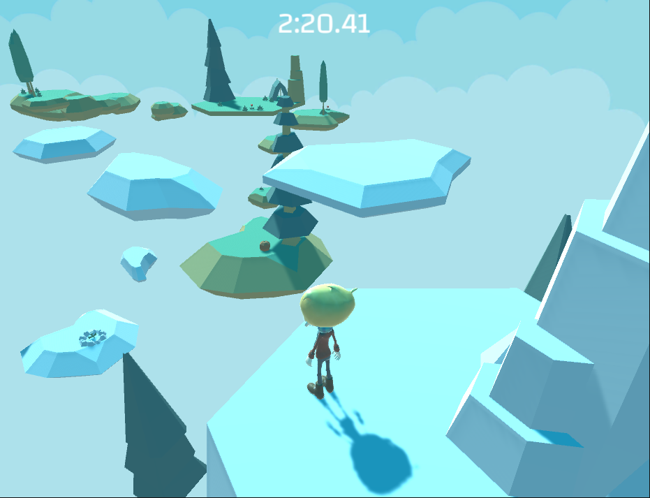

# 0x00. Unity - Audio

- What is an Audio Source
- What is an Audio Listener
- What is an Audio Filter
- What is an Audio Mixer
- What are snapshots
- What is a channel
- What is attenuation
- What is ducking
- How to control audio elements with scripts

Skyboxes: Farland Skies - Cloudy Crown ([source](https://assetstore.unity.com/packages/2d/textures-materials/sky/farland-skies-cloudy-crown-60004))
Models: Kenney's Nature Pack Extended ([source](https://kenney.nl/assets/nature-pack-extended))
Audio: Kenney ([website](https://kenney.nl/))
&emsp;Oculus Audio Pack ([source](https://intranet.hbtn.io/rltoken/VscmaPYMckVoCkn-HyJbJw))
&emsp;Mindful Audio ([website](https://intranet.hbtn.io/rltoken/UHFke5sYmkpW5_KUZl1QGQ))
&emsp;“Wallpaper”, “Cheery Monday” Kevin MacLeod (incompetech.com)
&emsp;Licensed under Creative Commons: By Attribution 3.0 (https://creativecommons.org/licenses/by/3.0/)
