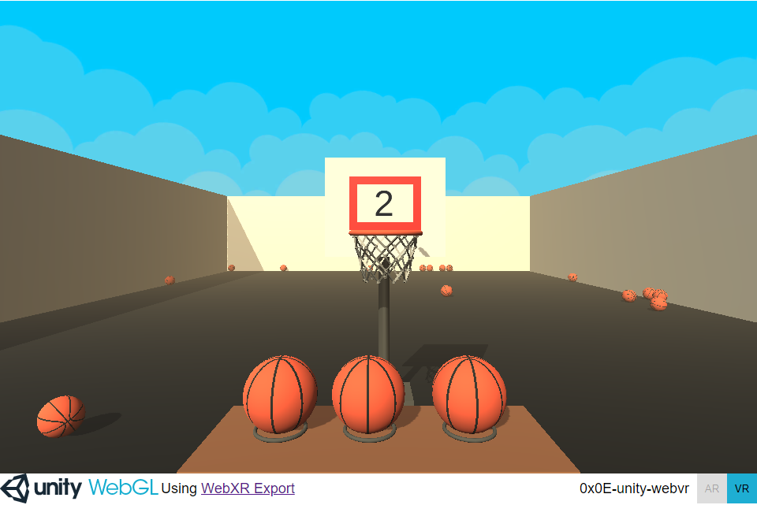

# 0x0E-unity-webvr

My first VR experience using WebXR, this time using Unity. It's a simple basketball shooting game, which you can access in your browser 
[here](https://jakefc.github.io/holbertonschool-unity/0x0E-unity-webvr/Build/), either with VR headset or mouse.

